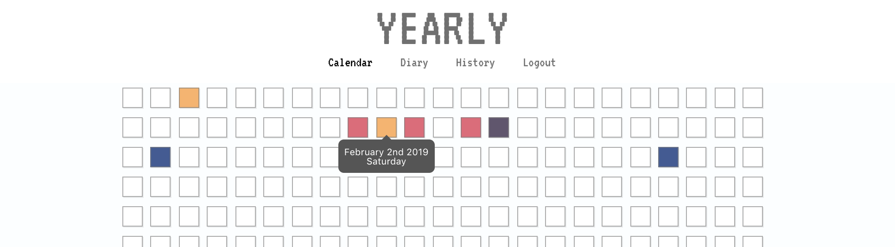
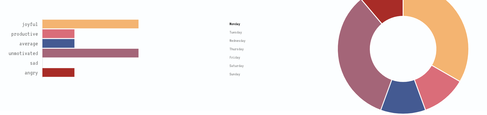
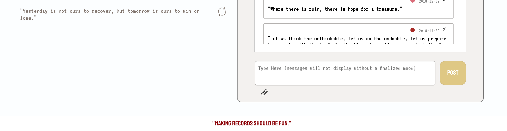
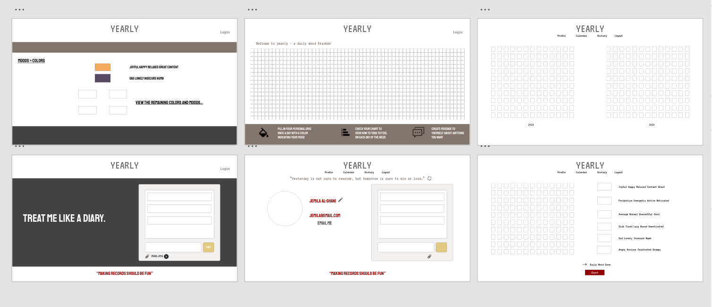

## Yearly

### Background

Yearly is a daily mood tracker JS application. Users will be able to post a color indicative of their mood once a day and post messages to their private diary.

As they post colors, users will be able to view their personal chart. The chart displays how many times a user picks a color each day of the week.

Check out the live version [here](https://www.pixelate.top/)

### Technology Overview

I built Yearly in less than two weeks; and, it was my first full stack web application. I used PostgreSQL, Node, Express and Massive to manage the backend. In order to manage state and the frontend, I used ReactJS/Redux, as well as CSS3 for frontend styling. Additionally, I used Auth 0, bcrypt, Cloudinary, Nodemailer and ChartJS.

### Grid of Colors (Moods)
Each user gets a grid of 366 boxes for each day of the year, including leap year. A user's previously selected colors, located in my database, gets put into state under this.state.pixalColors. 
Once in state, I map an array of length 366 and return 366 divs with appropiate information from this.state.pixalColors. <br>

In other words, at index 1 of the array I

1. check whether or not pixalColors has a date, January 1st, and the current year. If so, I return the index of that date and use that information to inline style the corresponding div.
2. check whether or not January 1st is today, also in respect to year. If so, the user's selected color will be put into redux and the corresponding div styled by props from redux. 

**Note that, each div has a popup that inidicates what day of the year the div is representing.**


The code below is the **phone display** of the user chart. Instead of showing all 366 days of the year, it show the current month. Also, the phone display does not have popups. 

```
let displayMonth =
      this.state.pixalColors &&
      arrayTwo.map(item => {
        if (
          this.state.pixalColors.findIndex(e => {
            return (
              e.date.substring(0, 4) == moment().format("YYYY") &&
              moment(e.date).dayOfYear() === item
            );
          }) !== -1
        ) {
          let index = this.state.pixalColors.findIndex(e => {
            return (
              e.date.substring(0, 4) == moment().format("YYYY") &&
              moment(e.date).dayOfYear() === item
            );
          });
          return (
            <div
              style={{ background: `${this.state.pixalColors[index].mood}` }}
              className={`day-${item}`}
            >
              {" "}
            </div>
          );
        } else if (item === moment().dayOfYear()) {
          return <div style={currentDay} className={`day-${item}`} />;
        } else {
          return (
            <div style={{ background: "white" }} className={`day-${item}`} />
          );
        }
      });
```

### Personal Chart
Here is a breakdown for the personal chart _when the user clicks on Monday_. 



This is how I dynamically input data into ChartJS. Like above, I am pulling the user's previously selected colors from the database. Once the user clicks on Monday, checkDatabase is ran which gives back the user's selected colors for only Mondays. Then pushToDataSet is ran with the colors for only Mondays and gives back a dataset filtered and counted by color. Lastly, everytime a user clicks a day of the week a clear function is ran. 

**code below**

```
<button onClick={() => this.dayOfWeek(Monday)}
 style={{ color: this.state.day === Monday && "black" }}>
Monday
</button>

checkDatabase(daySelected) {
    if (this.state.pixals) {
      for (let i = 0; i < this.state.pixals.length; i++) {
        let date = moment(this.state.pixals[i].date).format("dddd");
        date === daySelected[0] && daySelected.push(this.state.pixals[i].mood);
      }
      if (daySelected.length > 1) {
        this.pushToDataSet(daySelected);
      }
    }
  }
  clear() {
    const barData = { ...this.state.barData };
    dataset = [];
    barData.datasets[0].data = dataset;
    this.setState({ barData });
  }
  dayOfWeek(day) {
    this.clear();
    this.getPixals();
    this.checkDatabase(day);
    this.setState({ day });
  }
  pushToDataSet(day) {
    dataset.push(day.filter(item => item === "rgb(245,181,107)").length);
    dataset.push(day.filter(item => item === "rgb(220,108,120)").length);
    dataset.push(day.filter(item => item === "rgb(67,89,148)").length);
    dataset.push(day.filter(item => item === "rgb(165,100,120)").length);
    dataset.push(day.filter(item => item === "rgb(96,85,110)").length);
    dataset.push(day.filter(item => item === "rgb(170,43,34)").length);
  }
```

### Diary Page 

**points of interest**

a. The refresh icon triggers a quote of the day external api.<br>
b. The paperclip icon triggers Cloudinary so that you might include an image in your posts. <br>
c. (not displayed above) A mail icon triggers nodemailer and sends a welcome image to the email in the database for the user. <br>
d. (not displayed above) The user is allowed to edit/change their username. 

### WireFrame with Adobe XD


### Future Implements
I plan to add a section, History, for previous years, where grids from the previous two years will be displayed. I would also love to make this pwa so that I can have push notifcations. 
